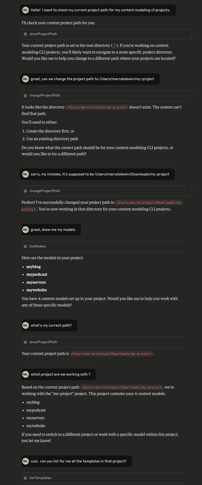

# Try Your First Chat

[<- Back](./configure-claude.md)&nbsp;&nbsp;&nbsp;|&nbsp;&nbsp;&nbsp;[Next ->](../../mcp-tools/README.md)  

This assumes you already have created a new Content Modeling MCP Server and CLI project.   

Start a new chat in Claude:

Type in:
````
Hello!  I want to check my current project path for my Content Modeling MCP Server and CLI projects.
````

It should first ask you for permission to run showProjectPath.   You can say "only once" or "always".  Up to you. If you say only once, it will ask you every single time.

````
Your current project path is set to the root directory (\). If you're working on Content Modeling MCP Server and CLI projects, you'll likely want to navigate to a more specific project directory.

Would you like me to help you change to a different path where your projects are located?
````

You can say "yes" and give it a new path or type the full sentence out:

````
Please switch to my project path, \your\project\path.
````

You can continue chatting with it, prompting it for these [tools](../../mcp-tools/README.md).

Here is an example of a full chat with the Content Modeling MCP Server and CLI.



[<- Back](./configure-claude.md)&nbsp;&nbsp;&nbsp;|&nbsp;&nbsp;&nbsp;[Next ->](../../mcp-tools/README.md)  